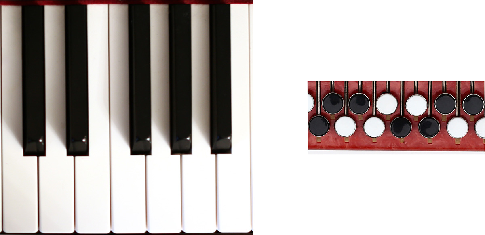
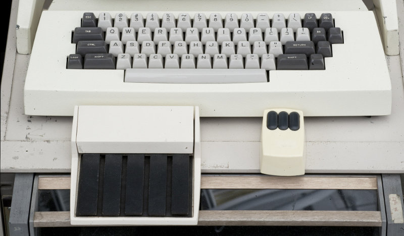
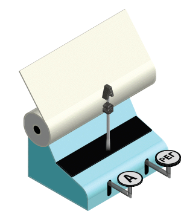
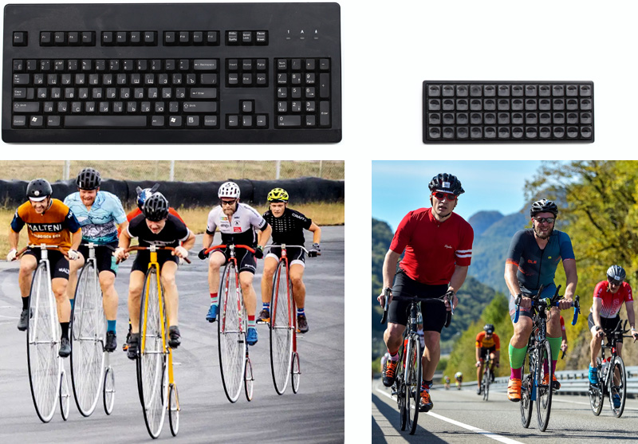

# Анахронизмы компьютерной клавиатуры (почему я отказался от стандартной клавиатуры и никогда к ней не вернусь) #

## Предисловие ##
Сколько не совершенствуй свои клавиатурные навыки, не достигнешь значительного прогресса, используя стандартную клавиатуру. Она давно устарела, но большинство готово с этим мириться.

---

*Привычка свыше нам дана:
Замена счастию она.*

За последние 30 лет из всех периферийных устройств персонального компьютера не изменилась только клавиатура. 
Причина этого не в её совершенстве, а в её сложности: к сложному долго привыкают, а привыкнув отвергают любые новшества.
Отсутствие развития стандартной клавиатуры создает рамки, ограничивающие развитие современных интерфейсов и снижающие продуктивность опытных пользователей.
Для того, чтобы понять, суть этой проблемы, достаточно разобраться в истории клавиатуры.

## История клавиатур для набора текста ##
Первая клавиатура для набора и передачи информации (в составе [первого электромагнитного телеграфа](https://polymus.ru/ru/museum/fonds/stock/apparat-telegrafnyy-shillinga-elektromagnitnyy-shestimultiplikatornyy-117395/)) была изобретена в России другом А. С. Пушкина — Павлом Львовичем Шиллингом в 1832 году. 

Клавиатура состояла из 16 клавиш фортепьянного типа. 

К 1860-м годам буквопечатающие телеграфные аппараты с клавиатурой фортепьянного типа использовались во всех развитых странах. Телеграфисты стали первыми пользователями клавиатур. Однако, использование телеграфных аппаратов для простой печати текстов было сравнимо со стрельбой из пушки по воробьям. Поэтому параллельно изобретались прототипы недорогих пишущих машин для делового использования.

Первые прототипы этих машин были ненадежны и сомнительны для инвесторов. В 1868 году американский изобретатель Кристофер Лэтем Шоулз запатентовал очередной прототип пишущей машины. Машина имела клавиатуру фортепианного типа ([патент US79868A](https://patents.google.com/patent/US79868A/)) и была с интересом воспринята телеграфистами.

{width=500px} 

Неугомонный Шоулз продолжил свои эксперименты и, чтобы уменьшить машину, заменил клавиатуру фортепианного типа на более компактную клавиатуру аккордеонного типа, состоящую из 4 рядов клавиш-пистонов ([патент US182511A](https://patents.google.com/patent/US182511A/)).

Машина Шоулза пополнила бы список практически-непригодных пишущих машин, если бы в 1873 году он не добился контракта на производство своей машины на оружейном заводе Ремингтонов в США. Опытные фабриканты-оружейники увидели большой коммерческий потенциал в машине Шоулза и довели её до ума.

{width=500px} 

Клавиатура именно этой машины впоследствии стала стандартом для всех пишущих машин, телетайпов (пишущих машин, связанных между собой по телеграфу для обмена сообщениями), терминалов (устройств для ввода команд и управления первыми компьютерами) и компьютерных клавиатур. Основные принципы этого стандарта:

- три буквенных и один цифровой ряд клавиш (расстояние между клавишами 3/4 дюйма); 
- клавиша-дощечка для пробелов;
- ряды клавиш с горизонтальным смещением;
- две клавиши смены регистра <kbd>Shift</kbd> по бокам клавиатуры;
- расположение букв в порядке `QWERTY`.

Клавиатура машины Шоулза кажется простой и привычной. Но, оказывается, она устарела уже через 5 лет после своего появления.

В первые годы производства пишущих машин инженеров заботила прежде всего надежность механизмов, а не скорость и удобство набора. Технический предел скорости набора на машине Шоулза из-за своего тугого механизма не превышал 60 слов в минуту. Это не было проблемой на момент её создания, так как не существовало людей, печатающих с такой скоростью. Поэтому, распространенный миф о том, что расположение клавиш `QWERTY` на машине Шоулза было выбрано для замедления проворных машинисток, ломающих машину бешеным темпом печати, не является правдой.

По мере повышения скорости работы машинистов и машинисток, инженеры озаботились простотой и удобством набора текста — эргономикой клавиатур.

## Теория эргономики клавиатуры ##
Максимальная простота и скорость набора текста на клавиатуре обеспечивается ее физической и когнитивной (психологической) совместимостью с пользователем (эргономикой).

**Физическая совместимость** — взаимодействие устройства и человека с учетом его анатомии. В случае взаимодействия человека и клавиатуры подразделяется на три составляющие:

- антропометрическая совместимость. Клавиши на клавиатуре должны максимально соответствовать форме и размерам пальцев рук.
- энергетическая совместимость. Нажатия должны происходить без лишних движений, а нагрузка сбалансирована между пальцами.
- сенсомоторная совместимость. Клавиши должны нажиматься осязаемо, легко и быстро.

При постоянном использовании клавиатуры, в мышцах, сухожилиях и суставах пальцев развивается ощущение направления движения и растяжения пальцев, необходимого для набора той или иной клавиши — моторная память.
Хорошая моторная память вырабатывается месяцами. Поэтому переход от одного типа клавиатур к другому так сложен.

Большинство пользователей клавиатуры не пользуются ею настолько часто, чтобы выработать идеальную моторную память.
Но опытные пользователи с идеальной моторной памятью при быстром наборе текстов рано или поздно упираются в потолок физической совместимости с клавиатурой, определяемый длиной перемещений пальцев от клавиши к клавише и их усталостью.

Поэтому пользователи, набирающие тексты двумя пальцами упираются в потолок физической совместимости раньше, чем пользователи, набирающие десятью пальцами: двум пальцам приходится преодолевать намного большее расстояние.
Минимизация движений обеспечивает лучшую физическую совместимость клавиатуры и рук.

На первых пишущих машинах нажатия или, вернее сказать, удары по клавишам выполнялись, в основном, указательными и средними пальцами, так как физически было сложно хорошо отпечатать букву, ударяя клавишу безымянным пальцем или мизинцем.
Не занятые мизинцы и безымянные пальцы использовались для удержания клавиш смены регистра, а большие пальцы для клавиши пробела.
Подобное расположение клавиш, ставшее привычным для нас, было пересмотрено инженерами в 1880-е.

Так у машин [Крендель (1883)](https://www.antiquetypewriters.com/typewriter/crandall-1-typewriter/), [Гаммонд Идеал (1885)](https://www.antiquetypewriters.com/typewriter/hammond-1-mahogany-typewriter/) и Беннетт (1907) клавиши пробела и смены регистра находилась в центре клавиатуры и нажималась указательными пальцами.

У машины [Каллиграф (1880)](http://www.besttypewriter.com/type/one-model?slug=calligraph-1) было две клавиши пробела, расположенные по бокам от клавиатуры.

Благодаря появлению машин с легким ходом клавиш, в 1888 году возник «слепой» 10-пальцевый метод набора, при котором все пальцы рук участвовали в наборе и были закреплены за своими клавишами. Это позволило значительно повысить скорость набора благодаря повышению физической и когнитивной совместимости: машинисты тратили меньше времени на перемещение пальцев и на визуальный поиск нужной клавиши.
Появилось понятие правильной расстановки пальцев, а также понятие основной (начальной, домашней) позиции пальцев на клавиатуре.

Начали выпускаться машины для «слепого» метода набора с оптимальным расположением букв на клавиатуре: наиболее частые алфавитные клавиши были размещены в основной позиции. [Бликенсдерфер (1893)](https://www.antiquetypewriters.com/typewriter/creelman-brothers-blickensderfer-5-portable-typewriter/).

Клавиши смены регистра стали располагаться не под мизинцами, а под большими пальцами, не занятыми в наборе букв [Франклин (1891)](https://www.antiquetypewriters.com/typewriter/franklin-2-typewriter/) и [Форд (1895)](https://www.antiquetypewriters.com/typewriter/ford-typewriter/).

Идеи, используемые в этих машинах, значительно повысили физическую совместимость клавиатур.

Ещё большее повышение физической совместимости достигалось за счёт сокращения количества клавиш, что требовало использования специальных приемов набора. 

## Приемы сокращения количества клавиш на клавиатурах ##

### Аккорды ###
На клавиатуре, ранее упомянутого телеграфного аппарата П. Л. Шиллинга (1832), было 12 клавиш для ввода букв. Первые 12 букв набирались одной клавишей, остальные буквы, а также цифры, набирались одновременным нажатием нескольких клавиш — аккордами.

Французский инженер Бодо пошел дальше и изобрел в 1872 телеграфный аппарат с клавиатурой из 5 клавиш: 2 для левой и 3 для правой руки. Буквы набирались аккордами, модулирующими 5 битный двоичный код. На основе кода Бодо в 1924 году был принят международный телеграфный код ITA2 (МТК-2). 

Обратите внимание, что самым частым буквам в телеграфном коде МТК-2 соответствуют самые легкие для набора комбинации, что снижает износ оборудования и позволяет сократить нагрузку на пальцы — повысить энергетическую совместимость.
Также обратите внимание, что буквы русского и латинского алфавита сопоставляются по фонетическому принципу. Данный принцип сопоставления, использующийся ещё с 1856 года в русском варианте азбуки Морзе, был впоследствии перенят для компьютерных кодировок КОИ-7 и КОИ-8.

В 1879 американский стенографист (судебный писарь) Майлс Бартоломью запатентовал [пишущую машину](https://www.antiquetypewriters.com/typewriter/stenograph-1st-form/), основанную на принципе телеграфа Бодо. При нажатии одной из 5 клавиш отпечатывался штрих в одной из 5 возможных позиций. Клавиши дублировались для правой и левой руки.

Машина позиционировалась Бартоломью как машина для стенографии — быстрой записи устной речи с использованием системы сокращений слов. Коллеги Бартоломью предпочитали эту простую машинку полноценным пишущим машинам по следующим причинам:

- пальцы не перемещались и постоянно находились в основной позиции.
- буквы набирались поочередно правой и левой рукой: когда первая рука заканчивала набор буквы, вторая рука начинала набирать следующую. Благодаря такому чередованию возрастала скорость набора.
- кроме аккордов для букв, использовались аккорды для частых биграмм английского языка (например биграмма th используется в английском языке чаще, чем буквы k, x, j, q, z).

Главный недостаток, из-за которого машина не обрела широкую популярность, был в необходимости расшифровки набранных штрихов и сокращений. Сегодня специальные программы легко расшифровывают набранный таким образом текст и компьютерная стенография становится все более популярной.

В 1892 году директор школы для слепых, Фрэнк Холл создал [машину](https://www.antiquetypewriters.com/typewriter/hall-braille-writer-1/) для тиснения на бумаге шрифта Брайля. Буквы тактильного шрифта Брайля кодируются комбинациями из 6 выпуклых точек. Соответственно, клавиатура машины состоит только из 6 клавиш для букв и 1 клавиши пробела. Одним аккордом набирается одна буква.

В 1973 году был создан прототип современного персонального компьютера — [Xerox Alto](https://habr.com/en/company/cloud_mts/blog/510502/). Клавиатура Xerox Alto предполагала совместное использование с мышью, поэтому не имела курсорно-цифрового блока. Третьим устройством ввода была аккордная клавиатура с пятью большими продолговатыми клавишами, не ставшая популярной и канувшая в лету.

### Регистры ###

**Регистр** — совокупность символов, выдаваемых клавишами клавиатуры (то же самое, что раскладка или слой)

Пишущая машина Шоулза образца 1873 года [Ремингтон № 1](https://upload.wikimedia.org/wikipedia/commons/thumb/3/35/Sholes_and_Glidden_Schreibmaschine_01.jpg/1280px-Sholes_and_Glidden_Schreibmaschine_01.jpg) не имела прописного регистра и могла печатать только строчные буквы.
Во второй модели 1879 года [Ремингтон № 2](https://www.antiquetypewriters.com/typewriter/remington-2-typewriter/) был добавлен механизм, позволяющий печатать с помощью одной клавиши два разных символа — механизм сдвига каретки (вала, перемещающего бумагу).

При поднятой каретке удар рычагов с литерами о бумагу приходился не на основной, а на дополнительный знак.
Для подъема каретки использовалась дополнительная клавиша <kbd>Shift</kbd> (англ. shift — сдвиг). 
Это решение усложняло машину, но позволяло набирать с помощью 42 клавиш 84 символа (два регистра).

У пишущей машины Крендель (1883) и [Гаммонд (1884)](https://www.antiquetypewriters.com/typewriter/hammond-1-mahogany-typewriter/) было уже три регистра, что позволяло с помощью 30 клавиш набирать 90 символов: 

1. строчные буквы,
2. прописные буквы, 
2. символы и цифры.  

У пишущей машины [Адлер 11 (1909)](http://www.besttypewriter.com/type/one-model?slug=adler-11) было **6 регистров**: 

1. строчные русские буквы, 
2. прописные русские буквы, 
3. символы и цифры для русского языка, 
4. латинские строчные буквы, 
5. латинские прописные буквы, 
6. символы и цифры для латинских языков.

До появления машины Адлер 11 для набора текстов на русском и английском (или французском, или немецком) приходилось иметь две отдельные машины, либо использовать машины со сменными литерами (например Адлер 7).

Пишущие машины не могли печатать буквы разных размеров и форм, так что для выделения заголовков использовались прописные буквы. Для удобства набора таких псевдо-заглавных букв, чтобы не держать клавишу регистра, а с нею и каретку, клавиша регистра стопорилась специальным замочком, который называли Caps Lock (англ. capitals — заглавные, англ. lock — замок). Сегодня данный прием потерял свою значимость, так как существует масса альтернативных способов выделения заголовков.

С появлением телетайпов, на клавиатурах стал использоваться управляющий регистр, когда при зажатой клавише <kbd>Ctrl</kbd> (англ. control — управление), алфавитные клавиши отправляли не буквы, а команды.

### Ритм нажатий ###
В 1838 году Сэмюэль Морзе предложил использовать для передачи информации по телеграфу только одну клавишу (ключ). Буквы кодировались ритмом и продолжительностью нажатия этого ключа.
Этот прием не использовался в пишущих машинах, но применим в компьютерных клавиатурах.

---

Перечисленные приемы и их комбинации позволяют кратно сократить количество клавиш клавиатуры без потери её функциональности, но значительно усложняют работу неподготовленного пользователя.
Так повышение физиологической совместимости приводит к снижению когнитивной совместимости.

**Когнитивная (психофизиологическая) совместимость** — взаимодействие устройства и человека с учетом его мыслительных способностей (восприятие, память, мышление).

Чтобы снизить когнитивную нагрузку, клавиатура должна обладать следующими свойствами:

- функциональность — возможность набора всех необходимых пользователю символов и команд.
- легкость восприятия — клавиши быстро идентифицируются визуально и тактильно.
- предсказуемость — клавиша вводит символ или команду, ожидаемую человеком.
- простота набора — количество сложных комбинаций, таких как смена регистра, сведено к минимуму.

Лучшую когнитивную совместимость обеспечивают клавиатуры с отдельными клавишами для всех необходимых символов и команд, так что пользователь не теряет времени на поиск и обдумывание нужной клавиши или комбинации клавиш.

В 1880-е годы ХIХ века, конструкторы пишущих машин пришли к мнению, что клавиатура должна быть как можно более проста в обращении. Использование клавиш смены регистров усложняло работу неопытных пользователей. Потому стали выпускаться машины с отдельными клавишами для всех символов, в том числе для прописных букв: [Каллиграф-2 (1882)](https://www.antiquetypewriters.com/typewriter/calligraph-2/), [Иост (1887)](https://www.antiquetypewriters.com/typewriter/yost-1-typewriter/), [Смис Премьер 1 (1889)](https://www.antiquetypewriters.com/typewriter/smith-premier-1-typewriter/), [Бар-Лок 4 (1893)](https://www.antiquetypewriters.com/typewriter/bar-lock-4-typewriter/).
 
Такие машины назывались машинами с полной клавиатурой, а машины с двумя регистрами называли машинами с полуклавиатурами.

Чтобы повысить структурное восприятие клавиш и скорость их обнаружения, ряды клавиш стали размещать прямой сеткой — **ортолинейно**, 

Сдвиг клавиш на первых пишущих машинах был технически-обусловленным решением, упрощающим устройство рычажной системы клавиатуры и сокращающим затраты на её производство.
Когда удобство использования стало важнее экономии в производстве, клавиши стали размещать без сдвига. Для этого просто изгибали рычаги клавиш. (Смис Премьер 1 (1889), [Empire 1 (1895)](https://www.antiquetypewriters.com/typewriter/empire-1-typewriter/), Беннетт (1907)).

Простота однорегистровых клавиатур имела и минусы: расстояние, преодолеваемое пальцами, увеличивалось, снижая физическую совместимость.

Однако, если сравнивать клавиатуру с отдельными клавишами для наиболее частых символов и команд (около 165 клавиш) со стандартной клавиатурой, то среднее расстояние, преодолеваемое пальцами на 165-клавишной клавиатуре, благодаря отсутствию перемещений для смены регистров, меньше на 20 %.

То есть физическая и когнитивная совместимость 165-клавишной клавиатуры значительно лучше, чем у стандартной клавиатуры.

---

Концепция клавиатуры с лучшей когнитивной совместимостью (165 клавиш) противоречит концепции клавиатуры с лучшей физической совместимостью (10 клавиш), поэтому не может существовать идеальной для всех пользователей клавиатуры.

Для неопытных пользователей максимальная скорость набора достижима на клавиатуре с лучшей когнитивной совместимостью.

Для опытных пользователей с развитой моторной памятью максимальная скорость набора достижима на клавиатуре с лучшей физической совместимостью.

Цена достижения лучшей физической совместимости — время на обучение. Развитие моторной памяти для быстрого набора текста на 10-клавишной клавиатуре у рядового пользователя затянется на несколько лет.

Определить целесообразность использования той или иной клавиатуры можно по объему набираемого за день текста.

## Теория набора текста ##

Время непосредственного набора текста на клавиатуре складывается из трех составляющих:

1. время нажатий клавиш — полезная работа.
2. время перемещения пальцев к нажимаемой клавише — бесполезная работа, снижающая физическую совместимость.
3. время обдумывания какую клавишу или комбинацию клавиш нажать — бесполезная работа, снижающая когнитивную совместимость.

Максимальную скорость набора можно достичь, сократив время нажатий клавиш (например, за счёт чередования пальцев) и избавившись от бесполезной работы — перемещений и обдумываний.

Зависимость физической и когнитивной совместимости можно представить, как зависимость времени перемещений пальцев и времени обдумывания от количества клавиш на примере трех клавиатур:

- стандартная 104-клавишная клавиатура;
- 165-клавишная клавиатура (максимальная когнитивная совместимость);
- 10-клавишная клавиатура (максимальная физическая совместимость).

) ](img/10k.jpg)

Эта зависимость будет разной для неопытных и опытных пользователей. Зависимость для неопытных пользователей, выглядит следующим образом:

Стандартная клавиатура расположена на самом верху диаграммы, так как требует больше всего времени на перемещение пальцев.

10-клавишная клавиатура расположена на самом краю диаграммы, так как требует больше всего времени на обдумывания, какую клавишу и как нажать.

Суммарное время, потраченное на бесполезную работу при наборе одного слова для неопытного пользователя получается следующим:

| Клавиатура | Время на перемещение и обдумывание, с/слово |
|------------|---------------------------------------------|
| 165        | 3,5                                         |
| 104        | 4,96                                        |
| 10         | 7                                           |

Таким образом, для неопытного пользователя эффективнее использовать для набора 165-клавишную клавиатуру.

По мере развития моторной памяти, когнитивная совместимость становится менее значимой для достижения максимальной скорости набора. Отпадает необходимость в подписях клавиш, набор клавиш и их комбинаций становится машинальным.

Кривая обучения выглядит по-разному для рассматриваемых клавиатур:

Пользователь, набирающий по 30 страниц в день развивает моторную память набора на 10-клавишной клавиатуре за 90 дней, а пользователь, набирающий одно письмо в день, достигнет такого же уровня моторной памяти только через несколько лет.

На 165-клавишной клавиатуре, оба пользователя достигнут высокой скорости набора за месяц.

При достижении скорости набора 50 слов в минуту возникает приятное ощущение опытности. Существуют целые [сообщества](http://klavogonki.ru/) пользователей, готовых набирать тексты ради удовольствия.
Переход на незнакомую клавиатуру резко снижает скорость набора, ощущение удовольствия сменяется ощущением мучения. Поэтому процесс переучивания не имеет для опытных пользователей ни эмоциональной, ни практической ценности в краткосрочной перспективе.

Но если сравнить трёх опытных пользователей рассматриваемых клавиатур, то зависимость физической и когнитивной совместимости для них будет выглядеть следующим образом:

Бесполезное время приблизилось к 0, а взаимное расположение клавиатур осталось прежним.
Суммарное время, потраченное на бесполезную работу при наборе одного слова для опытного пользователя:

| Клавиатура | Время на перемещение и обдумывание, с/слово |
|------------|---------------------------------------------|
| 10         | 0,100                                       |
| 165        | 0,223                                       |
| 104        | 0,282                                       |

Таким образом, опытный пользователь 10-клавишной клавиатуры будет тратить в среднем в 3 раза меньше времени на бесполезную работу по сравнению с опытным пользователем стандартной клавиатуры и в 2 раза меньше времени по сравнению с пользователем 165-клавишной клавиатуры.

Разница кажется не значительной, но если просуммировать бесполезное время за 30 лет использования клавиатуры, то для активного пользователя, даже с учётом потери времени на обучение, получается экономия в несколько суток.

Сокращение бесполезной работы за 30 лет при переходе опытного пользователя стандартной клавиатуры на 10-клавишную или 165-клавишную клавиатуру:

| Объем набираемого текста, слов/сут | Экономия времени 10-клавишной, сут | Экономия времени 165-клавишной, сут |
|------------------------------------|------------------------------------|-------------------------------------|
| 100                                | -2                                 | 1                                    |
| 1000                               | 10                                 | 7                                    |
| 10000                              | 195                                | 74                                    |

**Выводы:**

1. Опытные пользователи стандартной клавиатуры, набирающие 2—3 страницы в день, сэкономят от перехода на оптимальную клавиатуру несколько дней свой жизни.
2. Опытные пользователи стандартной клавиатуры, набирающие меньше одного письма в день, не получат от перехода на оптимальную клавиатуру никакой экономии из-за потерянного на переучивание времени.
3. Новым пользователям целесообразно сразу осваивать оптимальную клавиатуру.

**Оптимальная клавиатура** — клавиатура при использовании которой бесполезное время на перемещения и обдумывания сведены к минимуму.

Линия, соединяющая на диаграмме клавиатуру с лучшей физической и лучшей когнитивной совместимостью, является линией оптимальных клавиатур.

Может существовать множество оптимальных клавиатур с разными компоновками клавиш от лучшей физической до лучшей когнитивной.

Благодаря этому, изобретатели ХIХ века в конкурентной и патентной борьбе, не переставали создавать все более совершенные клавиатуры.

Такое разнообразие клавиатур стало проблемой для профессиональных машинистов и машинисток того времени, вынужденных переучиваться при переходе с одной машины на другую.

Под влиянием этой проблемы в 1888 году в Торонто состоялся съезд производителей пишущих машин, на котором расположение клавиш на клавиатуре машин Ремингтон (как наиболее распространенных) было признано стандартным. Золотой век развития клавиатур был закончен.

Машинистки и машинисты вздохнули с облегчением, но по мере появления новых функций пишущих машин, стандартная клавиатура начала обрастать по своей периферии новыми клавишами.

Как следствие, такое нагромождение клавиш привело к появлению комбинаций, набор которых осуществляется пальцами врастопырку, что со временем приводит к кумулятивным травмам опорно-двигательного аппарата верхних конечностей.

Вершиной процесса нагромождения дополнительных клавиш стала стандартная компьютерная клавиатура.

## Причины, по которым я отказался от использования стандартной клавиатуры ##

### Недостатки физической совместимости ###
1. Руки в основной позиции находятся в неестественном положении: образуется угол в запястье. Причина в близком расположении рук в основной позиции. Если бы основные позиции находились на ширине плеч, руки были бы в естественном положении.
2. Пальцы передвигаются не параллельно своей оси. Причина в сдвижке рядов.
3. Дальние перемещения к мышке. Причина в том, что изначально стандартная клавиатура не предполагала совместного использования с мышью.
4. Дальние перемещения к курсорно-цифровому блоку клавиш. 
5. Дальние перемещения к клавишам управления курсором.
6. Дальние перемещения мизинцев к периферийным клавишам, таким как <kbd>Tab</kbd>, <kbd>Ctrl</kbd>, <kbd>Backspace</kbd>, <kbd>Delete</kbd>. 
7. Сложные комбинации, неестественные для анатомии кисти (например <kbd>Ctrl</kbd>+<kbd>Shift</kbd> или <kbd>Alt</kbd>+<kbd>Shift</kbd>+<kbd>Tab</kbd>).
8. Дисбаланс нагрузки между пальцами:
 - чрезмерная нагрузка на мизинцы из-за большого количества периферийных клавиш.
 - малая нагрузка на большие пальцы, используемые в основном только для пробела.
 - неоптимальное для «слепого» набора расположение алфавитных клавиш `QWERTY`.

### Недостатки когнитивной совместимости ###
9. Диагональное расположение клавиш, снижающее структурное восприятие и замедляющее тактильную и визуальную идентификацию клавиш.
10. Большое количество регистров (строчные, прописные, русские, английские, управляющие, дополнительные. Неопытные пользователи не знают, что блок управления курсором меняет регистр на цифровой при нажатии клавиши NumLock и поэтому, опасаясь получить неожиданный результат, просто им не пользуются).
11. Дублирование частых клавиш (<kbd>Ctrl</kbd>, <kbd>Alt</kbd>, <kbd>Shift</kbd>, <kbd>Win</kbd>) с правой стороны создает дополнительную когнитивную нагрузку.
12. Отсутствие клавиш для частых символов. На клавиатуре нет клавиш для используемых в русской письменности символов `«»` `—`; нет клавиш для используемых в математике символов, таких как `≠` `−` (минус).
13. Отсутствие клавиш для самых частых команд. Например, клавиши <kbd>копировать</kbd> и <kbd>вставить</kbd>.
14. Отсутствие клавиши смены алфавитных регистров с английского на русский (такая клавиша есть на японской версии стандартной клавиатуры, так как японский пользователь был более требовательным и приоритетным). Вместо этого используются разные комбинации управляющих клавиш.
15. Несоответствие клавиш русского и английского алфавитного регистра, из-за чего русскоязычному пользователю необходимо запоминать два расположения фонетически схожих клавиш, что крайне негативно сказывается на когнитивной совместимости.
16. Несоответствие символьных клавиш между русским и английским алфавитным регистром (точка, запятая и пр.) 
17. Невозможность набора некоторых символов из определенных алфавитных регистров (`№` из английского, `[]{}<>` из русского).
18. Несколько подписей на клавишах замедляют их визуальную идентификацию.

Часть из перечисленных недостатков достались стандартной клавиатуре по наследству от стандартной пишущей машины, часть из них обусловлена тем, что изначально стандартная клавиатура (IBM Model M) предназначалась для работы в текстовом интерфейсе (терминал IBM 3161) и не предполагала одновременного использования с мышью.

Все эти недостатки стали привычными для современных пользователей. Трудно подсчитать, сколько времени и нервов потрачено на их преодоление.
Эти недостатки повлияли и на культуру письма и речи:

- вместо математических символов в программировании используются их суррогаты, состоящие из доступных со стандартной клавиатуры символов, например `!=` или `<>` вместо `≠`.
- вместо классических кавычек (`«»` для русского языка, `“ ”` для английского), стало нормой использовать универсальную кавычку суррогат `"`.
- вместо тире `—` стало нормой использование дефиса `-`.
- стало нормой записывать сокращения без пробелов после точки: `А.С.Пушкин` вместо `А. С. Пушкин`.
- вместо `сделай по шаблону`, стали говорить `сделай контрол+ц, контрол+в`
- вместо `запечатлей`, стали говорить `заскринь`.
- русскоязычные пользователи шифруют свои пароли, используя фонетическое несоответствие клавиш между русским и английским алфавитным регистром.

Но в отличие от пользователей ХIХ, современные пользователи перестали быть привязанными к производителям клавиатур, а сами клавиатуры стали настолько легкими, что их можно носить на работу в кармане.

Современные возможности клавиатуростроения позволяют легко преодолеть все недостатки стандартной клавиатуры, о чем будет рассказано в следующей статье.

Проникшись историей клавиатур, становится удивительно, что недостатки клавиатуры 150 летней давности сохранились до наших дней. Использование стандартной клавиатуры в наш век можно сравнить с использованием её ровесника — большеколесного велосипеда, появившегося также в 1870-х. Он тоже был сложен в освоении и далек от идеалов эргономики. И если бы все велосипедные заводы договорились 150 лет назад производить только один стандартный тип велосипеда, мы бы ездили на нем до сих пор и с недоверием относились бы к более скоростным и удобным велосипедам.

## Источники (раскрываемый список) ##

[Пишущие машины 1894]: ссылка "Пишущие машины : Ист. очерк и описание всех систем пишущих машин : Сост. по книге F. Drouin: Les machines à ècrire, по сведениям, помещ. в каталогах, прейс-курантах и на основании опыта письма помощью машины. - Санкт-Петербург : Е.П. Павлова, 1894. "
[ГОСТ 14289-88]: ссылка "Клавиатуры. Расположение клавиш и символов, функции управляющих клавиш"
[ГОСТ 27465-87]: ссылка "Системы обработки информации. Символы"
[ГОСТ 14873-86]: ссылка "Клавиатура телеграфных аппаратов ГОСТ 14873-86"
[ГОСТ 15607-84]: ссылка "Аппараты телеграфные буквопечатающие стартстопные пятиэлементного кода"
[ГОСТ 27466-87]: ссылка "Системы обработки информации. Методы расширения кодов"
[DHIATENSOR]: https://deskthority.net/wiki/DHIATENSOR "Blickensderfer Electric"
[Политех]: https://404content.bm.digital/v1/storage/image/resize/123/707/533/808/527/911/4.jpg "Blickensderfer Electric"
[процедурные коды]: https://en.wikipedia.org/wiki/Prosigns_for_Morse_code
[Шиллинг]: http://r9o.ru/?page_id=3695
[qwerty]: https://repository.kulib.kyoto-u.ac.jp/dspace/bitstream/2433/139379/1/42_161.pdf "Yasuoka, Koichi; Yasuoka, Motoko (March 2011). On the Prehistory of QWERTY" (PDF)."

[Hermann Scholz]: ссылка "Hermann Scholz Die Schreibmachine und das Maschinenschriben 1923"
[Rheinmetall Herold][https://typewriterdatabase.com/1937-rheinmetall-herold.15453.typewriter]

Леонов Илья Васильевич

