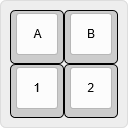
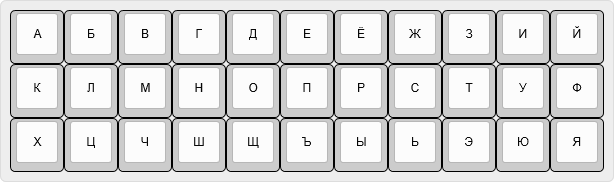
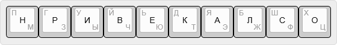

# Часть 2. Возможности современного клавиатуростроения (программные) #

О возможностях программируемых клавиатур и о том как можно радикально увеличить скорость набора текста с помощью повышения физической совместимости

-[ ] пример прошивки и логотип QMK

В [предыдущей статье](https://habr.com/ru/post/701494/) я обозначил недостатки стандартной клавиатуры, из-за которых работа на ней может быть неудобна, медленна и вредна для здоровья рук.

Часть недостатков можно устранить программно, но все недостатки можно устранить только с помощью клавиатур с оптимальным расположением клавиш. Основным критерием оптимальности в контексте данной статьи будет минимизация времени на перемещение пальцев по клавиатуре.
Чем меньше перемещений пальцев по клавиатуре, тем большую скорость набора текста и вызова команд можно достичь.

Перед выбором клавиатуры с определенным набором клавиш, которые кажутся нужными, важно разобраться в программных возможностях, позволяющих сделать некоторые из них ненужными.

О том какие существуют возможности программируемых клавиатур, как можно увеличить скорость набора текста с помощью повышения физической совместимости (сокращения перемещений и нажатий), я хотел бы рассказать в данной статье.

## Принцип работы компьютерной клавиатуры ##

Большинство не стандартных клавиатур управляются микроконтроллерами ATmega32u4, STM32F303, RP2040 и пр.

При нажатии на клавишу происходит замыкание контактов микроконтроллера, преобразуемое им в код стандартного протокола USB HID. Микроконтроллер отправляет этот код компьютеру/планшету/смартфону, а тот преобразует полученный код в команду или символ (в соответствии с выбранным алфавитным режимом).


В соответствии с протоколом USB HID, клавиатуре отведено 224 кода. Остальные устройства ввода (мышки, графические планшеты, джойстики и пр.) отправляют аналогичные коды. 

Микроконтроллер способен отправлять компьютеру любые коды USB HID.
Таким образом, клавиатура может заменить любое периферийное устройство ввода.

Микроконтроллер может по-разному интерпретировать нажатия клавиш в зависимости от времени удержания клавиши, её нажатия совместно с другими клавишами и пр.
Так нажатия одной клавиши могут преобразовываться микроконтроллером в разные коды.

Для предопределения отправляемых микроконтроллером кодов, его необходимо должным образом запрограммировать. 
Для упрощения программирования используются библиотеки для создания прошивок, такие как QMK, ZMK, TMK и пр.

## Программирование клавиатур (прикладное отступление) ##
В статье рассматриваются возможности программирования микроконтроллеров на примере открытой библиотеки на языке Си — [QMK](https://docs.qmk.fm/) (квантовая механическая клавиатура). Библиотека постоянно развивается и поддерживается большим сообществом.

Для использования QMK удобнее всего установить готовую среду сборки [QMK (библиотека QMK + MSYS2 + приложение для прошивки микроконтроллеров)](https://msys.qmk.fm/).

Для программирования микроконтроллера своей клавиатуры, кроме библиотеки QMK, достаточно создать несколько файлов в библиотеке:

1. qmk_firmware/keyboards/моя_клавиатура/название_клавиатуры.h — обозначение матрицы клавиш.
2. qmk_firmware/keyboards/моя_клавиатура/config.h — сопоставление контактов микроконтроллера с обозначенной матрицой клавиш.
3. qmk_firmware/keyboards/моя_клавиатура/keymaps/default/keymap.c — сопоставлением матрицы клавиш с отправляемыми ими кодами.
4. qmk_firmware/keyboards/моя_клавиатура/rules.mk — файл с перечнем необходимых функций библиотеки QMК.

Для программирования существующих на рынке клавиатур проще скопировать соответствующую директорию qmk_firmware/keyboards/существующая_клавиатура и работать с нею.

Перед началом процесса обновления, микроконтроллер переводится в режим обновления прошивки устройства (DFU). Для этого необходимо замкнуть контакты `GND` и `RST` на плате контроллера (для упрощения процедуры, переход в DFU лучше сразу назначить на клавишу клавиатуры в одном из настраиваемых регистров).

Далее компилятору дается команда:

	qmk flash -kb моя_клавиатура -km default

После выполнения команды, прошивка создается и записывается в микроконтроллер.

[Полная документация](https://docs.qmk.fm/#/newbs_getting_started)

## Сопоставлением матрицы клавиш с кодами ##

В QMK используются [свои обозначения](https://docs.qmk.fm/#/keycodes) для кодов клавиш.
Так, для кода клавиши `А` используется код `KC_A`, для кода клавиши `1` код `KC_1`, а для кода клавиши `1` цифрового блока `KC_KP_1`.

Для сопоставления физической матрицы клавиш с программной, соответствующие коды клавиш прописываются через запятую в файле keymap.c следующим образом:



```
const uint16_t PROGMEM keymaps[][MATRIX_ROWS][MATRIX_COLS] = { 
	[OCHOBA] = LAYOUT_ortho_4x4(
	KC_A, KC_B,
	KC_1, KC_2
	),
};
```
В матрице можно обозначить все возможные для клавиатуры (и не только для клавиатуры) коды клавиш.

Важно понимать, что стандартные коды для клавиатуры не содержат русских букв и символов юникода. То есть нет кодов `KC_Ж`, `KC_П` и пр.

QMK позволяет прописывать в матрице сервисные коды. 

Например:

код `S(KC_3)` будет передаваться клавиатурой как коды `KC_LSFT` + `KC_3`; 
код `C(KC_C)` как коды `KC_LCTL` + `KC_C`; 
код `C(А(KC_DEL))` как коды `KC_LCTL` + `KC_LALT` + `KC_DEL`.

Также в матрице прописываются коды специальных функций QMK или заранее обозначенные клавиши с определенной последовательностью кодов.

Обычно пользователи, которым достаточно функционала клавиш стандартной клавиатуры, просто меняют сопоставление клавиш в матрице файла `keymap.c`. Оптимальное расположение клавиш на матрице — тема для отдельной статьи.
Но как не меняй клавиши, их функциональность от этого не изменится. Для нестандартного поведения клавиш существуют специальные функции QMK.

## Многокомандные/программные клавиши ##

Одна клавиша может отправлять не один код, а последовательность кодов с заранее заданой скоростью и порядком.

Так можно заменить часто-используемые командные комбинации клавиш нажатием одной клавишей.

Например можно сделать клавишу `Копировать` при нажатии которой клавиатура отправляет коды `KC_LCTL` + `KC_C`.

Можно заменить частые нажатия нескольких клавиш одной клавишей.
Например после нажатия клавиши запятой `,` почти всегда следует `пробел`.
Одна клавиша с кодами `KC_COMM` + `KC_SPC` в два раза ускоряет скорость набора этой последовательности в тексте.
Аналогично можно поступить с точкой. После точки почти всегда набирается пробел и слово с большой буквы.
Одна клавиша с кодами `KC_DOT` + `KC_SPC` + `KC_LSFT` в три раза ускоряет скорость набора этой последовательности в тексте.

##[Send String. Набор слов и текстов одной клавишей](https://docs.qmk.fm/#/feature_send_string)
Можно настроить на одну клавишу автоматический ввод часто используемых слов или словосочетаний, таких как ФИО, пароли, частые команды и пр.


Для этого в файл keymap.c (или в специальном файле для настройки поведения клавиш) добавляется следующий код:
```
bool process_record_user(uint16_t keycode, keyrecord_t *record) {
    switch (keycode) {
        case KL_1:
            if (record->event.pressed) {
                SEND_STRING("Privet, Habr!\n");
            }
            return false;
    }
    return true;
}
```
Обозначенная клавиша KL_1 добавляется на матрицу.

Таким же образом можно набирать одной клавишей редкие символы с помощью Alt-кодов Windows.
Например, для ввода тире `—`  можно использовать сочетание `alt` + `0151`, записываемое кодом `SEND_STRING(SS_LALT(SS_TAP(X_KP_0)SS_TAP(X_KP_1)SS_TAP(X_KP_5)SS_TAP(X_KP_1)))`.
При нажатии на такую клавишу тире клавиатура моментально вводит Alt-код, как если бы вы нажимали обычную клавишу буквы.

### Вызов сложных команд одной клавишей ###
[Функция Macros](https://docs.qmk.fm/#/feature_macros?id=macros) 
Клавиатура может «работать» за вас, если вы хотите имитировать работу (актуально для удаленных работников).
Можно настроить клавишу, после нажатия на которую, клавиатура беспрерывно отправляет коды движения курсора мышки, коды набираемых букв и т. п. Отключается такой «вспомогательный» режим повторным нажатием на клавишу или через заданное время.

## Клавиши смены регистра ##
**Регистр** — совокупность символов, выдаваемых клавишами клавиатуры (то же самое, что раскладка или слой). 

**Клавиша смены регистра (клавиша-модификатор)** — клавиша, нажатие на которую модифицирует коды, посылаемые другими клавишами.

Регистры можно разделить на два класса:

	1. Регистры определяемые системой
					  ____________
      			 	 /           / 
	строчные		/___________// 
	прописные		/___________// — Shift
	управляющий		/___________// — Ctrl
	дополнительный	/___________// — Alt
	комбинированный	/___________/  — Ctrl + Shift
	
	2. Регистры определяемые клавиатурой
					  ____________
      			 	 /           / 	 
	заглавный		/___________// — Caps Lock
	Специальный_1	/___________// — C_1
	Специальный_2	/___________/  — C_2
					  _:_:_:_:_:__ 
			       	 / : : : : : / 
	Специальный_31	/___________// — C_31
	Специальный_32	/___________/  — C_32

Сперва необходимо разобраться с обычными системными регистрами, вызываемыми клавишами модификаторами `Shift`, `Ctrl`, `Alt` и пр.

Клавиши-модификатора можно разделить на три класса, по времени модификации:

- временная смена регистра
- одноразовая смена регистра
- постоянная смена регистра

### Временная смена регистра (при удержании клавиши) ###
Нажатая и удерживаемая клавиша модифицирует нажатия других клавиш. При отпускании клавиши, модификация прекращается.
Всем известные примеры: клавиши `Shift`, `Ctrl`, `Alt`, `Win`.


QMK позволяет менять стандартные правила модификации. Например выполнять альтернативные команды при нажатии клавиш с удерживаемым `Shift`.

Так, вместо двух клавиш `Backspace` и `Delete` можно использовать только одну клавишу `Backspace`, превратив сочетание `Shift` + `Backspace` в `Delete`.

Для этого в файл прошивки (keymap.c) добавляется следующий код:

	bool shift_held = false; 					// создаем логический индикатор нажатого Shift (не активный)
	case KC_LSFT:								// в случае нажатия клавиши Shift   
    	shift_held = record->event.pressed; 	// активируем индикатор нажатого Shift
    	return true; 							// и выполняем обычное действие (отправляем код клавиши Shift)
    break; 
    case KC_BSPC: 								// в случае нажатия клавиши BS
      if (record->event.pressed & shift_held)	// если индикатор нажатого Shift активен
      {
      	unregister_code(KC_LSFT); 				// отпускаем Shift
      	tap_code(KC_DEL); 						// нажимаем и отпускаем DEL
      	return false;							// не выполняем обычное действие (не нажимаем BS)
      }
    break;

### Объединение клавиши-модификатора с обычной клавишей ###
[Функция Mod-Tapи](https://docs.qmk.fm/#/mod_tap?id=mod-tap)
Можно сделать клавишу, при удержании которой она модификатор (`Shift`, `Ctrl`, `Alt` и пр.), а при коротком нажатии обычная клавиша (`А`, `Б`, `В` и пр.).
Пример на раскладке ЙЦУКЕН:

Удержание клавиши `А` превращается в удержание `Ctrl`,

Удержание клавиши `В` превращается в удержание `Shift`,

Удержание клавиши `Ы` превращается в удержание `Alt`,

Удержание клавиши `Ф` превращает клавиши `О`, `Л`, `Д`, `Ж` в курсорные клавиши `←`, `↓`, `↑`, `→` (функция Layers).

Так, я могу перемещать курсор, выделять текст, использовать командные комбинации (горячие клавиши), не отнимая пальцы с основного ряда.
Это решение полностью исключает все бесполезные перемещения пальцев на клавиши-модификаторы, значительно повышая скорость управления клавиатурой.

### Одноразовая смена регистра ###
[Функция One Shot Keys](https://docs.qmk.fm/#/one_shot_keys?id=one-shot-keys) 
После нажатия и отпускания клавиши-модификатора, модифицируется только первая нажатая следом клавиша. 
Известный пример: клавиша `⇧` на сенсорной телефонной клавиатуре.
Клавиша позволяет писать слова с прописными буквами используя для набора только один палец.

### Постоянная смена регистра ###


Нажатие и опускание клавиши-модификатора приводит к постянной модификации (смене регистра), повторное нажатие на клавишу прекращает модификацию.
Известный пример: клавиши `Caps Lock`, `Num Lock`

### Специальные регистры (слои) ###
[Функция Layers](https://docs.qmk.fm/#/feature_layers?id=layers) 
QMK позволяет создавать настраиваемые регистры в виде дополнительных матриц клавиш в файле keymap.c.

Так на клавиатуре с 33 клавишами (для букв), можно сделать отдельные регистры для цифр, командных клавиш, символов.

Активация специальных регистров осуществляется с помощью обозначенных в основном регистре клавиш-модификаторов, которые также могут быть временными, постоянными или одноразовыми.
Также активировать специальные регистры можно с помощью аккордов.



QMK позволяет создать 32 специальных регистра, но на практике трудно запомнить расположение клавиш большого количество регистров без соответствующих подписей.

Для индикации выбранного регистра могут использоваться светодиоды или залипающие механизмы клавиш, превращающие, с помощью механической фиксации, временные клавиши-модификаторы в постоянные.
Так `Caps Lock` условно можно заменить клавишей `Shift` с залипающим механизмом или использовать [виртуальное залипание клавиш (Key Lock)](https://docs.qmk.fm/#/feature_key_lock) 

## Аккорды клавиш ##
[Функция Combos](https://docs.qmk.fm/#/feature_combo?id=combos)
Аккорд — одновременное нажатие нескольких клавиш, преобразуемое микроконтроллером в код команды или символа.


С помощью аккордов можно вводить недостающие буквы, символы или целые слова и числа.
Пример: 

- одновременное нажатие клавиш `С` и `Е` выдает букву `Ц`.
- одновременное нажатие клавиш `П` и `Р` выдает символ `%`.
- одновременное нажатие клавиш `П` и `В` выдает слово `привет`.
- одновременное нажатие клавиш `3` и `1` выдает число `3,14159265358979`.

Ещё удобнее использовать данную функцию для вызова команд, не отрывая пальцев от основной позиции.
Пример на раскладке ЙЦУКЕН:

- одновременное нажатие клавиш `В` и `А` — `Enter`
- одновременное нажатие клавиш `А` и `О` — `Tab`
- одновременное нажатие клавиш `Ф` и `Ы` — `Backspace`
- одновременное нажатие клавиш `Ы` и `В` — `пробел`
- одновременное нажатие клавиш `Н` и `Ч` — `Home`
- одновременное нажатие клавиш `К` и `Н` — `End`
- одновременное нажатие клавиш `Р` и `У` — активирует русский алфавитный режим и информирует об этом первыми тремя нотами гимна России посредствам встроенного в клавиатуру динамика. 
- одновременное нажатие клавиш `А` и `Н` — активирует английский алфавитный режим и информирует об этом первыми тремя нотами гимна США.
- одновременное нажатие клавиш `Ц` и `Ф` — переключает клавиатуру на цифровой регистр. Выход из цифрового регистра происходит по таймеру, через 2 секунды после прекращения набора цифр.	

Таким образом можно вообще отказаться от командных клавиш на клавиатуре, оставив только алфавитные.
Командные аккорды очень удобны и быстро запоминаются.

## Управляющая последовательность нажатий клавиш ##
[Функция The Leader Key](https://docs.qmk.fm/#/feature_leader_key?id=the-leader-key-a-new-kind-of-modifier) 
Последовательное нажатие нескольких клавиш, преобразуемое в команду или символ.


Известный пример: Alt-команды в Microsoft Office для выбора необходимого пункта меню и командный режим Vim.

Клавишу активации режима управляющей последовательности удобно назначить на одиночное нажатие клавиши-модификатора `Ctrl`.
Пример: 

последовательное нажатие клавиш `Ctrl`, `2` — выдает знак второй степени `²`

последовательное нажатие клавиш `Ctrl`, `Р` — активирует русский алфавитный режим

последовательное нажатие клавиш `Ctrl`, `A` — активирует английский алфавитный режим

## Ритмическая клавиша ##
[функция Tap Dance](https://docs.qmk.fm/#/feature_tap_dance?id=tap-dance-a-single-key-can-do-3-5-or-100-different-things) 
Нажатие одной клавиши может по разному интерпретироваться микроконтроллером в зависимости от ритма нажатия. Такие параметры нажатия клавиши, как время удержания, количество нажатий за заданный промежуток времени можно использовать для того, чтобы изменять отправляемые ею коды. Так любая клавиша может быть аналогом ключа Морзе.


### время удержания ###
С помощью функции [Auto Shift](https://docs.qmk.fm/#/feature_auto_shift?id=auto-shift-why-do-we-need-a-shift-key) Можно сделать, чтобы короткое нажатие клавиши `А` отправляло строчную `а`, а долгое нажатие прописную `А`.
Так можно значительно оптимизировать перемещения пальцев на клавишу `Shift`.

[Функция Space Cadet](https://docs.qmk.fm/#/feature_space_cadet?id=space-cadet-the-future-built-in) позволяет отправлять коротким нажатием левого `Shift` код левой скобки `(`, а правого `Shift` код правой скобки `)`

### темп нажатий ###
Можно сделать клавишу, поведение которой зависит от количества её нажатий за короткий промежуток времени.

Например можно переделать клавишу курсора `←` так, что при однократном нажатии она работает обычным образом, при двукратном нажатии как клавиша `Home`. 
Клавиша `Backspace` при однократном нажатии удаляет букву, а при двукратном слово.

### направление хода ###
Клавиша может посылать разные коды в зависимости от того, нажимается она или отпускается.

Можно сделать клавишу, нажатие на которую отправляет код `C(KC_C)` — копирует текст, а отпускание отправляет код `C(KC_V)` — вставляет текст.

### комбинированные ###
В клавише можно использовать сразу несколько ритмических функций.
Можно заменить все клавиши скобок всего двумя клавишами.

| Нажатие клавиши     | `(` | `)` |
|---------------------|-----|-----|
| одиночное           | (   | )   |
| двойное             | «   | »   |
| долгое              | [   | ]   |
| одиночное с `Shift` | <   | >   |
| долгое с `Shift`    | {   | }   |

## Ускорение набора текста ##

[Функция Autocorrect](https://docs.qmk.fm/#/feature_autocorrect) позволяет производить автокоррекцию текста на уровне клавиатуры, а не операционной системы или текстовой программы.
Если вы не верно написали слово, например `пивет` вместо `привет`, клавиатура сама заменит его на `привет`.

Самое эффективное применение функции автокоррекции — использование системы сокращения частых слов.
Так, вместо того, чтобы полностью набирать слово `привет` можно набрать только `пв`, а клавиатура сама допишет недостающие буквы.

На 10 клавишной клавиатуре можно сделать аналог телефонной системы предугадывания слов T9.
Так, чтобы ввести слово `привет` на клавиатуре с 10 клавишами, где для каждой из клавиш определено три буквы,



необходимо нажать клавиши в последовательности `Н`, `Р`, `И`, `В`, `Е`, `К`.
Клавиатура сама исправит `нривек` на `привет`.

Освоив систему сокращения слов, можно назначить аккорды на наиболее частые словосочетания.
Написать слово привет можно одним нажатием — аккордом клавиш клавиш `П` и `В`. 
Так **скорость набора можно увеличить в 10 раз!**

| Набор          | время, мс |
|----------------|-----------|
| слово `привет` | 1000      |
| буквы `пв`     | 400       |
| аккорд `пв`    | 100       |

Сокращения и аккорды позволяют кратно сократить перемещения пальцев.

Примечание: Учитывая ограниченную память микроконтроллеров, функцию автозамены для больших словарей проще реализовать на уровне операционной системы, например с помощью ПО AutoHotKey.

[Функция набора заглавных предложений. Caps Word](https://docs.qmk.fm/#/feature_caps_word)
Во отличие от `Caps Lock` при наборе в таком режиме вместо пробелов будут ставится нижние прочерки: НАПРИМЕР_ТАКИМ_ОБРАЗОМ.
Также можно сделать режим записи слов без пробелов: НапримерТакимОбразом.

#### Безопасность ####

Клавиатуру можно использовать для ввода заранее записанных в нее паролей с помощью спрятанных в регистрах клавиш или сложных аккордов. Так становится невозможно отследить последовательность набора пароля, даже посредствам видеофиксации (в том числе тепловизора).

[Функция Secure](https://docs.qmk.fm/#/feature_secure) — с помощью спрятанных в регистрах клавиш или сложных аккордов можно заблокировать клавиатуру или перевести её в альтернативный режим работы.

## Замена устройств ввода ##

[Функция отправки любых HID кодов](https://docs.qmk.fm/#/feature_rawhid?id=raw-hid)
Клавиатура может заменить любое устройства ввода.

### Мышь ###
[Функция Mouse keys](https://docs.qmk.fm/#/feature_mouse_keys?id=mouse-keys)
Перемещение курсора мыши клавишами не очень удобно, но бывает полезно.
Также функция позволяет настроить клавиши для прокрутки (скролл мыши). Благодаря возможности тонкой настройки ускорения, такие клавиши прокрутки намного удобнее обычного колеса прокрутки мыши.

### Стенотипия ###
[Функция Stenography](https://docs.qmk.fm/#/feature_stenography?id=stenography-in-qmk)
В западном делопроизводстве для записи стенограмм используется стенотипия — печать текста на стенографической машине. Стенографическая машина — рекордсмен по скорости набора текста (375 слов в минуту). 
Профессиональная компьютерная стенаграфическая машина стоит около 1000 $, поэтому возможность эмулировать стенографическую машину с помощью клавиатуры важна для стенографов-любитей.
Особенностью функции стенографии, отличающей её от упомянутой функции аккордов, является использование специального [ПО для расшифровки аккордов](https://www.openstenoproject.org/plover/).

### Небольшой экскурс в стенотипию ###
Стенографическая машина для набора буквенных сокращений была изобретена французом Шарлем Бивортом в 1904 году и называлась Стенофил [Stenophile][https://www.antiquetypewriters.com/typewriter/stenophile-shorthand-machine/]
При наборе, в отличие от клавиатуры пишущей машины, нажимается сразу несколько клавиш, отпечатывающих за раз слово или слог. Такие слоги отпечатываются в одну строку на рулонной бумаге. После каждого аккорда происходит переход на новую строку.
-[ ] стенография
Для оптимизации набора, используется только 20 клавиш, а недостающие буквы набираются комбинацией из имеющихся или заменяются на фонетически схожие буквы: буква Д заменяется буквой Т, а буква П буквой Б.
Некоторые буквенные клавиши дублируются для удобства сокращения и записи слов в одну строку.
Раньше запись с рулона требовала последующей расшифровки. Сегодня, на цифровых стенографических машинах, сокращения автоматически преобразуются компьютером в слова в соответствии со встроенным словарем.
При наборе аккорда букв, компьютер воспринимает их в порядке расположения клавиш — слева на право.
Простой пример «Там стоит треск», набирается в три аккорда:

ТАМ СТОИТ ТРЕСК

Если попробовать набрать этот текст аккордами на обычной клавиатуре, то из-за невозможности определения последовательности букв, их порядок нарушится и получится что-то вроде: мат остит скерт.

Но есть и сложные примеры записи, требующие знания системы сокращений. Пример «Покрытый снегом дом», набирается в 5 аккордов:

ПОКР ТЕОИ СНЕВК ОМ ТВОМ 

Из-за отсутствия клавиш для букв Г и Д они заменяются двумя буквами (ЕВ и ТВ).

Из-за сложности изучения системы сокращений, время подготовки опытного англоязычного стенаграфиста составляет около 3 лет.
В России машинная стенография не обрела популярности из-за большого количества падежей, букв, большой длины слов в русском языке.

----

Освоение указанных приемов кардинально упрощает манеру использования клавиатуры. Трудности при возврате к стандартной клавиатуре возникают не из-за иного расположения букв, а из-за отсутствия этих приемов.

Было бы интересно узнать ваши идеи использования описанных возможностей.

Автор: Леонов Илья


Теги: qmk клавиатура


Хабы:    Производство и разработка электроники  Гаджеты  Периферия