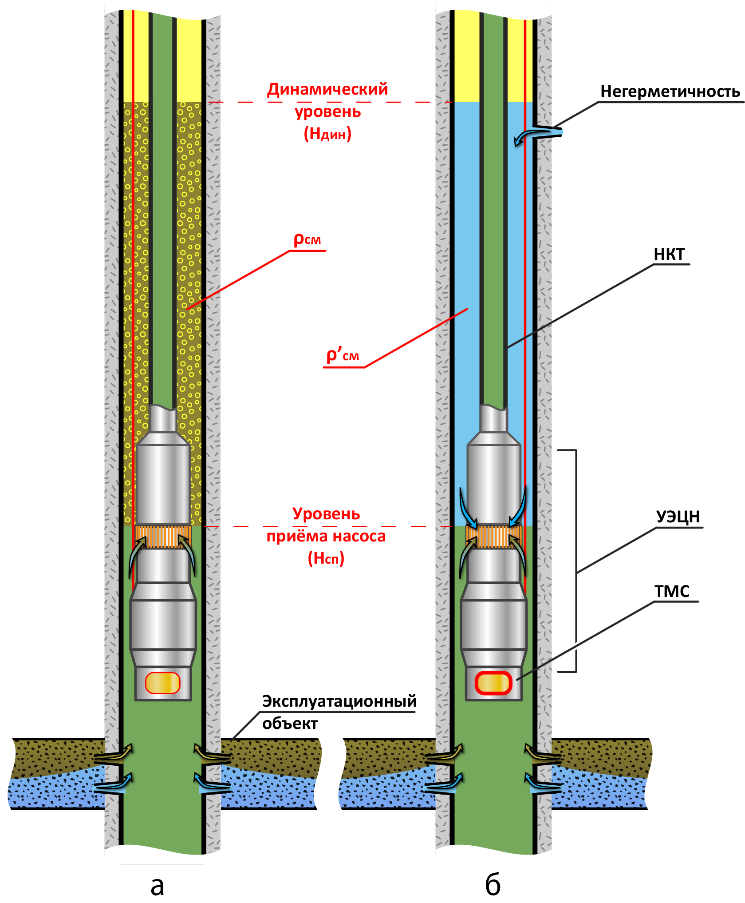

## Гидродинамический метод выявления притока воды из негерметичности эксплуатационной колонны, расположенной над УЭЦН
### Введение
Оценка герметичности колонны труб производится в процессе её опрессовки. Колонна считается герметичной, если в процессе её опрессовки при опрессовочном (заданном) давлении давление не снижается, например, в течение тридцати минут более чем на 0,5 МПа (как правило, измерение давления осуществляется каждые пять минут). При этом заданное давление опрессовки соотносят с возрастом скважины. Основными причинами потери герметичности обсадной колонны могут быть: 

1. негерметичность резьбовых соединений;  
2. коррозионное разрушение;  
3. различные механические разрушения.  

Существует достаточное количество различных методов определения местоположения и характера нарушения герметичности обсадных колонн, среди которых геофизические, геохимические, акустические, фототелеметрические и другие. 

Все известные методы обладают различной сложностью, стоимостью, разрешающей способностью, точностью и оперативностью. Как правило, для выполнения работ по оценке герметичности колонн, требуется привлечение специальной техники.

Автором предлагается простой, оперативный и достаточно точный гидродинамический способ оценки негерметичности эксплуатационной колонны, связанный с притоком воды через негерметичность, расположенную выше установки ЭЦН.

Современные технические средства добычи нефти оснащены штатной измерительной системой погружной телеметрии (система ТМС в установке ЭЦН). При этом давление на приёме ЭЦН является измеряемым параметром. 

 

*Рисунок 1. Схема компоновки погружной установки ЭЦН в скважине: а — при отсутствии притока воды в эксплуатационную колонну; б — в случае притока воды в эксплуатационную колонну*

На рисунке 1 приведены схемы погружной компоновки при эксплуатации скважины установкой ЭЦН (рисунок 1а — при отсутствии притока воды в эксплуатационную колонну — колонна герметична; рисунок 1б — в случае притока воды через негерметичность в эксплуатационной колонне выше погружного агрегата ЭЦН).

Известно, что при эксплуатации скважины установкой ЭЦН над приёмом насоса (в интервале «динамический уровень — приём насоса») находится жидкая фаза, через которую барботирует газ, формируя газожидкостную смесь (ГЖС). Плотность такой смеси ρ_см можно рассчитать по эталонной кривой распределения давления в затрубном пространстве или по одной из известных зависимостей, например [1](#источники) :

\(ρ_{см} = [1 - {V_з \over \bar{υ}_o^c f_з}(1-{ρ_г \over ρ_ж})]\), 
(1)

где   
\(ρ_ж\) — плотность жидкости, находящейся над приёмом насоса, кг/м³;   
\(V_з\) — объёмный расход газа через затрубное пространство, м³/с;   
\(\bar{υ}_o^c\) — осреднённая относительная скорость газовых пузырьков в неподвижной жидкости (истинная скорость газа), м/с;   
\(f_з\) — площадь поперечного сечения кольцевого канала (затрубного пространства), м²;  
\(ρ_г\) — плотность газа, кг/м³.

Обозначим плотность газожидкостной смеси в затрубном пространстве скважины в случае «а» (рисунок 1а) через \(ρ_{см}\), а в случае «б» (рисунок 1б) — через \(ρ'_{см}\). Если в случае «а» жидкость представлена, в основном, нефтью, то в случае «б» — жидкость представлена смесью нефти и воды.

\(ρ_{см} = ρ_н (1-β)+ρ_вβ\), (2)

где   
\(ρ_н\) — плотность нефти в затрубном пространстве, кг/м³;  
\(β\) — объёмная обводнённость жидкости в затрубном пространстве за счёт поступаемой через негерметичность обсадной колонны воды, д. ед;  
\(ρ_в\) — плотность поступившей в скважину воды, кг/м³.

Как следует из <a href="#формула-2">(2)</a>, плотность жидкости над приёмом ЭЦН \(ρ_ж\) меняется в пределах:

\(ρ_н < ρ_ж \leqslant ρ_в\), (3)

Анализ выражения <a href="#формула-1">(1)</a> показывает, что при прочих неизменных условиях (постоянство \(V_з\), \(\bar{υ}_o^c\), \(f_з\) и \(ρ_г\)) плотность смеси \(ρ_{см}\) однозначно определяется только величиной \(ρ_ж\), зависящей, в свою очередь, от плотностей нефти и воды, а также от объёмного содержания воды в затрубном пространстве, которое принципиально может изменяться в пределах от 0 до 1. 

Исходя из вышеизложенного, сформулируем сущность предлагаемого метода определения негерметичности эксплуатационной колонны, базирующегося на измерении давления на приёме насоса \(P_{пр}\) с одновременным измерением динамического уровня \(H_{дин}\) с использованием следующих зависимостей.

В соответствии с результатами исследований <a href="#источники">[1]</a> можно записать следующую взаимосвязь между основными параметрами процесса: 

\(ρ_{см} = {(P_{пр}-P_{ур})\over g(H_{сп}-H_{дин})}\),  (4)

\(P_{ур} = P_{затр}\cdot е^ {0.03415\cdot ρ_{го}\cdot H_{дин} \over z_{ср}\cdot T_{ср}}\), (5)

где 
\(ρ_{см.ф}\) — фактическая плотность смеси в затрубном пространстве, кг/м³; 
\(P_{пр}\) — измеренное давление на приёме насоса, Па; 
\(P_{ур}\) — давление на измеренном динамическом уровне \(Н_{дин}\), Па; 
\(H_{сп}\) — известная глубина спуска УЭЦН, м; 
\(P_{затр}\) — давление в затрубном пространстве на устье скважины (известная величина), Па; 
\(ρ_{го}\) — относительная плотность газа в интервале от устья скважины до динамического уровня, кг/м³; 
\(z_{ср}\), \(T_{ср}\) — относительная плотность газа в интервале от устья скважины до динамического уровня, кг/м³;

Сопоставляя рассчитанную по зависимости <a href="#формула-1">(1)</a> величину плотности смеси \(ρ_{см}\) с фактической плотностью смеси \(ρ_{см.ф}\) по <a href="#формула-4">(4)</a> с учётом <a href="#формула-5">(5)</a>, можно судить о наличии или отсутствии «посторонней» воды над приёмом у ЭЦН.

Измерения давления на приёме ЭЦН можно осуществить:
1. погружной телеметрической системой (ТМС), расположенной под ПЭД на достаточно близком расстоянии от приёма ЭЦН (газосепаратора);  
2. манометром, расположенным над обратным клапаном ЭЦН (также достаточно близко от приёма ЭЦН). При этом автор использует сменный манометр, устанавливаемый и извлекаемый из скважинной камеры (мандрели) с помощью канатной техники.

### Результаты
По предлагаемому методу выявления притока воды из негерметичности эксплуатационной колонны был проведён анализ фонда скважин СНГДУ-2 ОАО «Самотлорнефтегаз», оборудованных исправной ТМС в установке ЭЦН. Анализу подвергнуто 206 скважин. По результату анализа выявлено, что 40 % скважин работают с перетоком воды из негерметичности эксплуатационной колонны и с перетоком добываемой продукции через НКТ

<svg xmlns="http://www.w3.org/2000/svg" id="sv" width="180" height="180" viewBox="0 0 180 180"><path id="0" fill="#FE715D" d="M90, 0 A90,90 0 0 1 168.8436380815966,133.40139092308232 L133.80202115644255,114.11188384615684 A50,50 0 0 0 90,40 Z"></path><path id="1" fill="#CA5949" d="M168.8436380815966, 133.40139092308232 A90,90 0 0 1 145.9654869559755,160.4830778966167 L121.09193719776417,129.15726549812038 A50,50 0 0 0 133.80202115644255,114.11188384615684 Z"></path><path id="2" fill="#FD9B8D" d="M145.9654869559755, 160.4830778966167 A90,90 0 1 1 89.98429203681187,0.0000013707783779182137 L89.99127335378436,40.000000761543546 A50,50 0 1 0 121.09193719776417,129.15726549812038 Z"></path>
<text y="60" x="140">68</text>
        <text y="120" x="10">125</text>
        <text y="140" x="135">13</text>
</svg>

*Рисунок 2. Результаты анализа фонда скважин: 125 — скважины без перетока; 68 — скважины с перетоком; 13 — скважины с перетоком НКТ.*

### Источники
1. Мищенко И. Т. Скважинная добыча нефти. М. Изд-во «Нефть и газ» РГУ нефти и газа им. И. М. Губкина, 2007. 826 с.
2. Мищенко И. Т. Теория и практика механизированной эксплуатации скважин с вязким и многофазным флюидами. Дис. д. т. н. М. 1983.
3. Грон В. Г., Мищенко И. Т. Определение забойного давления в добывающих скважинах, оборудованных установками погружного центробежного насоса, Москва 1993, 128 с.
4. Сахаров В. А. Экспериментальное определение относительной скорости движения газового пузырька в потоке жидкости. Изв. Вузов нефть и газ № 6 1966, с. 68—72.
5. Пантелеев Г. В., Богомольный Г. И., Мусаверов Р. А. Расчет давления у приема насоса (башмака труб) и на забое скважин. Учебное пособие по курсу «Технология и техника нефтедобычи» для студентов специальности 0205 — «Технология и комплексная механизация разработки нефтяных и газовых скважин». М., 1981 г., 42 с.

*УДК 622.276; негерметичность эксплуатационной колонны; телеметрическая система (ТМС); геофизические исследования скважин (ГИС); установка электроцентробежного насоса (УЭЦН); добывающая скважина; контроль технологических параметров УЭЦН; интеллектуализация скважины*

Опубликованно: [Нефтепромысловое дело № 5 / 2011](http://www.vniioeng.ru/inform/neftepromysel/sod41)

Леонов Илья Васильевич
